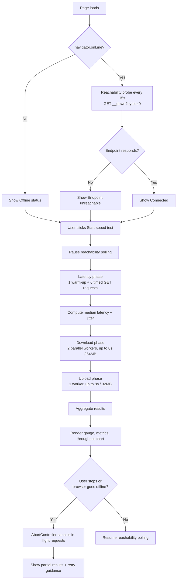

# Pulse — Internet check

A responsive React + Vite + Tailwind CSS application that checks connection reachability and estimates internet speed with real HTTP transfers from the visitor's browser. Written in JavaScript (`.js` / `.jsx`). No API key, account, database, or application backend is required.

Pulse runs entirely client-side: a single-page React app measures latency, jitter, download, and upload throughput by making real HTTP requests to Cloudflare's public speed-test endpoints, then renders the results with a live gauge, a cumulative throughput chart, and a plain-language explanation of what each number means. There is nothing to deploy but static files, and nothing to configure beyond an optional Content Security Policy allowance.

## Why it exists

Most "speed test" widgets either require a backend proxy (which changes the network path you're actually measuring) or hide their methodology entirely. Pulse does neither: it is a thin, auditable client over Cloudflare's documented speed-test protocol, with the measurement logic isolated in one small module (`src/network.js`) so the approach — timeouts, retry behavior, budget caps, cancellation — is easy to read and reason about.

## How it works

The high-level flow, from page load to a finished test:



Each phase streams incremental updates back into React state (`onUpdate` callbacks in `runSpeedTest`), which is what drives the live gauge, the phase-progress rail, and the cumulative throughput chart while a test is running — nothing is computed only at the end.

## Run locally

Use Node.js 20.19+ (Node.js 22 LTS or later recommended).

```bash
npm ci
npm run dev
```

Open the local URL printed by Vite (port 4173 by default).

```bash
npm run build
npm run preview
npm test
```

## Host it yourself

The archive includes the editable project and a ready-built `dist/` directory. Upload the **contents of `dist/`** to any static HTTPS host. No Node.js process is needed in production. Do not open `index.html` via `file://`; serve it over HTTP/HTTPS.

- **Vercel:** import the source project, choose Vite, install with `npm ci`, build with `npm run build`, and publish `dist`.
- **Netlify or Cloudflare Pages:** build command `npm run build`; output directory `dist`.
- **Nginx, Apache, S3 + CloudFront:** serve the generated `dist` files. Assets use relative paths, so a subdirectory works too.

If your host applies a Content Security Policy, allow `connect-src https://speed.cloudflare.com`. The default app needs no credentials. The optional `.openai` manifest is excluded from the self-hosting archive; it is only for the private preview.

## Features

- Immediate browser online/offline detection and a lightweight HTTP reachability check.
- Automatic reachability checks every 15 seconds while the page is visible; paused during a speed test to avoid competing traffic.
- Download and upload estimates, median HTTP latency, and jitter.
- Live logarithmic gauge, cumulative throughput chart, progress stages, and cancellation.
- Responsive desktop/mobile layout, keyboard controls, reduced-motion support, accessible labels, and text status announcements.
- Explicit partial results and retry guidance after cancellation or failure. Never substitutes generated values.
- Optional WebMCP tool integration so an AI agent running in a supporting browser can read displayed results or trigger a real test on the visitor's behalf.

## Design decisions worth knowing

- **No backend, no proxy.** Requests go straight from the browser to Cloudflare. Proxying through a server or serverless function would change the network path being measured and understate real-world latency.
- **Real transfers, not simulated ones.** Download and upload numbers come from actual HTTP payloads with real timing, not a formula derived from a single ping. This costs bandwidth (up to 96 MB per test) but produces a truer picture of achievable throughput.
- **Conservative upload accounting.** An upload chunk only counts if the server acknowledges it before the deadline. Incomplete uploads at the time limit are dropped rather than pro-rated, which biases the upload estimate low on unstable connections rather than reporting an inflated number.
- **Adaptive chunk sizing.** Each transfer worker resizes its next request chunk based on how fast the previous one completed, so both very slow and very fast connections converge on a reasonable measurement resolution within the time budget.
- **Everything is cancellable.** A single `AbortController` per test run cancels every in-flight request immediately, whether the user clicks Stop or the browser reports it went offline mid-test.
- **No silent success.** If a phase can't produce a real number (blocked endpoint, captive portal, malformed response), the app surfaces an explicit error instead of showing a plausible-looking placeholder.

## How measurements work

The endpoint protocol is documented by [Cloudflare's speed test project](https://github.com/cloudflare/speedtest). This application uses its own small measurement implementation in `src/network.js`, not the Cloudflare SDK.

1. **Reachability:** uncached `GET https://speed.cloudflare.com/__down?bytes=0` with a five-second timeout. Browser network availability and endpoint reachability are separate signals. A failed request does **not** prove the entire internet is down.
2. **Latency:** one warm-up request, then six HTTP round trips. The displayed value is their median; jitter is the mean absolute difference between consecutive timings. Request overhead and server processing are included. This is not ICMP ping.
3. **Download:** two concurrent workers stream uncached responses for at most eight seconds, or until a shared 64 MB requested-payload budget is exhausted. Received bytes, including a partial response at the time limit, divided by elapsed wall time produce the aggregate estimate.
4. **Upload:** one worker sends randomly filled payloads for at most eight seconds, capped at 32 MB. Only HTTP-successful, acknowledged requests count. Incomplete uploads at the deadline are excluded, giving a conservative estimate on slow or unstable links. Actual data sent can be greater than the measured-payload display, but stays within the requested 32 MB cap plus overhead.
5. **Cancellation:** AbortController cancels all active transfers. A run interrupted by the browser's offline event is also stopped. Individual latency requests time out after five seconds. A test usually takes around 20 seconds; high latency can extend it (maximum about 51 seconds under functioning timers).

MB is decimal (1,000,000 bytes); Mbps is 1,000,000 bits/second. The total payload limit is 96 MB, plus HTTP/TLS/network overhead. Throughput charts show a cumulative average for each phase, not instantaneous line speed. Fast connections may hit the budget in less than a second; the app flags such short samples. The gauge uses a logarithmic scale and visually caps at 1 Gbps, while the numeric reading remains uncapped.

## Accuracy, endpoint availability, and privacy

These are **browser HTTP throughput estimates**, not a certified line-capacity benchmark. HTTP overhead, browser scheduling, server distance, Wi-Fi, VPNs, concurrent traffic, short samples, and the data budget affect results. Keep the tab in the foreground and close competing downloads. A backgrounded tab may be throttled, so elapsed time and abort timing can be less precise.

The app depends on Cloudflare's publicly accessible test endpoints and their CORS policy. Service changes, rate limits, VPN filtering, captive portals, content blockers, or a restrictive host CSP can prevent measurements. Errors are displayed clearly. For an independently operated endpoint, adapt `DOWNLOAD_URL`, `UPLOAD_URL`, and the request/validation contract in `src/network.js` and enable CORS for your host. Avoid proxying through a function with payload limits; that would change the path you measure.

Results stay in React state and disappear on reload. The app adds no analytics, cookies, IP geolocation lookup, or local storage. Cloudflare necessarily receives requests and the visitor's IP address; see [Cloudflare's privacy policy](https://www.cloudflare.com/privacypolicy/). Browser-provided physical connection type is shown only when available; `effectiveType` is deliberately not used as a Wi-Fi/4G hardware label.

## Project layout

```text
src/App.jsx          Interface, React state, connection monitoring
src/network.js       Abortable measurements, statistics, data caps
src/styles.css       Tailwind import, theme, responsive components
src/main.jsx         React entry point
tests/network.test.js  Measurement and error-path tests
public/favicon.svg   App icon
vite.config.js       React and Tailwind Vite plugins
```

Tailwind uses its [official Vite plugin](https://tailwindcss.com/docs/installation/using-vite). Optional WebMCP tools are registered only in browsers with `document.modelContext` support: `read_connection_test` and `run_connection_speed_test`. Both accept `{}`; running a test consumes the same bandwidth as the visible Start control.

## Validation

`npm test` uses Node's built-in test runner with isolated HTTP fixtures to exercise unit conversion, latency statistics, parallel download budgets, acknowledged upload bytes, HTTP failures, malformed payloads, cancellation, timeouts, and full phase sequencing. Fixtures are only in tests; the shipped app always uses real endpoints.

Delivery verification: all eight automated tests passed, the production build passed, and a real browser test completed both transfer phases. Stop/Run Again and the desktop layout were checked. The test browser did not support WebMCP, so that optional integration could not be verified live. Mobile breakpoints are implemented, but a separate mobile-device browser run was not performed.

## Troubleshooting

- **"Endpoint unreachable" while other sites load fine.** The reachability probe hits `speed.cloudflare.com` specifically. A content blocker, corporate proxy, VPN split-tunnel rule, or captive portal can block that one host while leaving the rest of the internet reachable.
- **Test never finishes / hangs on one phase.** Each latency request times out after five seconds and each transfer phase is capped at eight seconds, so a run should never hang indefinitely. If it appears stuck, the tab may have been backgrounded and throttled by the browser — bring it back to the foreground or click Stop and retry.
- **Numbers look lower than expected.** Check for other devices or tabs using bandwidth, VPNs adding overhead, or a backgrounded tab being deprioritized by the browser's timer throttling. The "short sample" note means the data budget was exhausted in under a second, which can undercount very fast links.
- **Nothing loads at all / blank page.** Confirm the app is served over HTTP/HTTPS, not opened via `file://` — module scripts and `fetch` credentials behave differently under the `file:` origin and the app will not run correctly there.
- **Want to point this at your own endpoint?** Update `DOWNLOAD_URL`, `UPLOAD_URL`, and `TEST_LIMITS` in `src/network.js`, ensure your endpoint enables CORS and honors the same request contract (see `validate()` in that file), and adjust any CSP `connect-src` rule accordingly.
